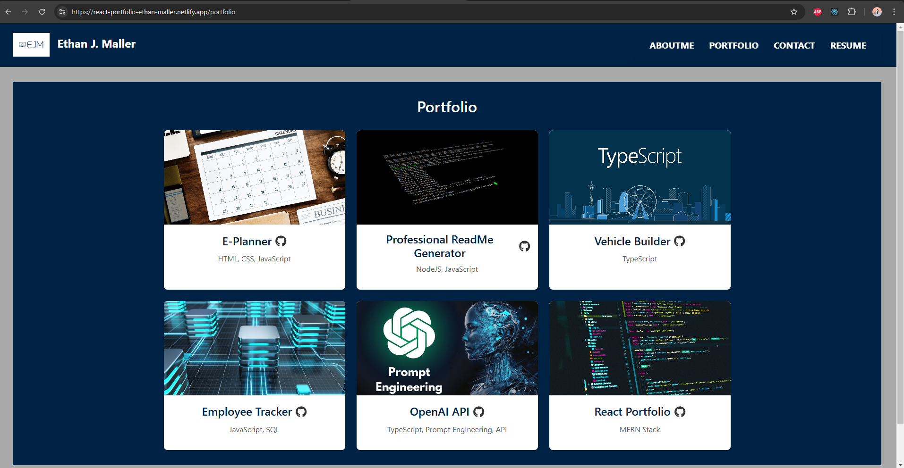

# React Portfolio
  

  ## Description
  This a portfolio written with React that displays a few pages.  There is content About Me, a page that allows people to contact me, a page that displays my resume to be available to download, and finally, a page that displays relevant projects and links to their respective GitHub repositories.  This is intended to display a portfolio of a little about me and my accomplishments thus far as a software developer

  ## Table of Contents
  - [Installation](#installation)
  - [Usage](#usage)
  - [Links](#links)
  - [License](#license)
  - [Contributing](#contributing)
  - [Tests](#tests)
  - [Questions](#questions)

  ## Installation
  ```
  npm install npm install --include=dev
  ```

  ## Usage
  To anyone who may be using this repo, this is intended to be a portfolio about you as a software developer. Use this to display your software developing skills and update the necessary fields to ensure it is personalized to you

  ## Links
  Deployed Application Link: (https://react-portfolio-ethan-maller.netlify.app/)
  

  ## License
  [MIT License](https://opensource.org/licenses/MIT)

  ## Contributing
  Contributing to this particular repo is pointless as this information is tailored to me and my experience and journey as a software developer. But to anyone contributing to their own repo, ensure to update the content in the componenets folders in order to ensure it is personalized to you, along with updating the images and resume

  ## Tests
  ```
  npm run dev
  ```

  ## Questions
  GitHub: [ejmaller7](https://github.com/ejmaller7)
  Email: mallerethan4@gmail.com
